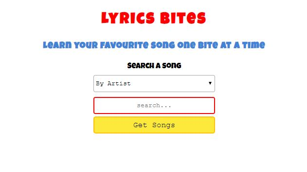

## `Lyrics Bites`

Learn your favourite song one bite at a time

### `The inspiration`

My girlfriend always told me ..."David if you really want to improve your English you'd better learn the song lyrics,  
that is one of the best things for mastering the spoken English" 

That's great but every time I tried it I always stopped my self after memorizing the first couple of verses 
I thought, why not to build a web-application where I can finally receive via e-mail one verse per day or 
maybe every two days or more?

### `Goals`

Said that, I decided to build first the front-end side to mastering my React skills HTML/CSS 
and then I would like to add a backend later 
The idea is to query an API to retrieve the song lyrics and then give the possibility to the user to chunk the song 
Then set it to receive one verse everyday in his email address.
